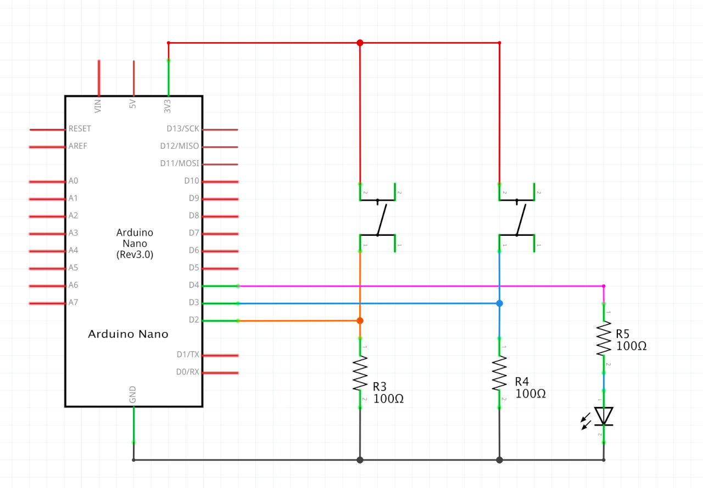
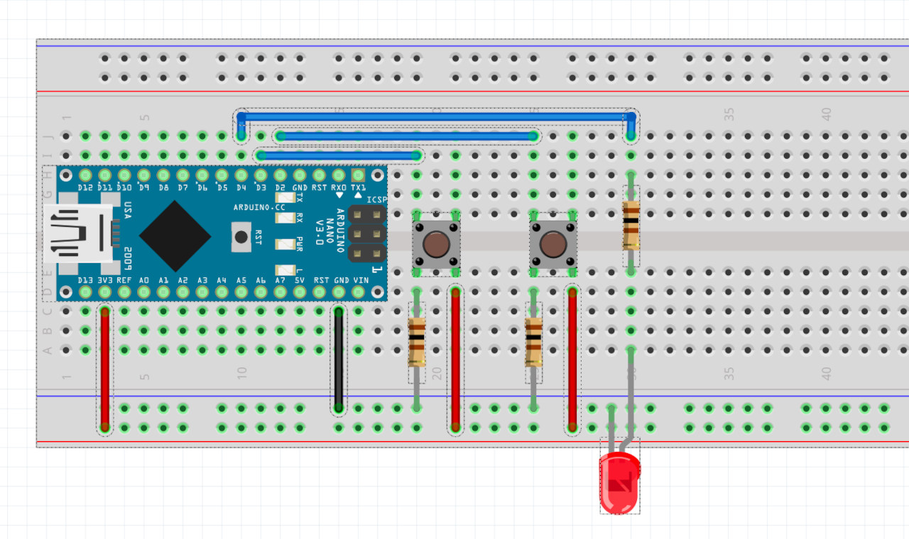

# HW12 - Serial

Maze game from week09 ([code](https://github.com/DM-GY-6063-2023F-D/week09/tree/main/play-maze), [original game](https://dm-gy-6063-2023f-d.github.io/week09/play-maze/)), but updated to use an Arduino with 2 push-buttons to control it.

The object that is created by the Arduino and sent to p5js looks like this:

```
data = {
  D2: {
    isPressed: boolean,
  },
  D3: {
    isPressed: boolean,
  }
}
```

```D2.isPressed``` is used to rotate left by 1° and ```D3.isPressed``` to rotate right by 1°.

## Schematic



## Board


