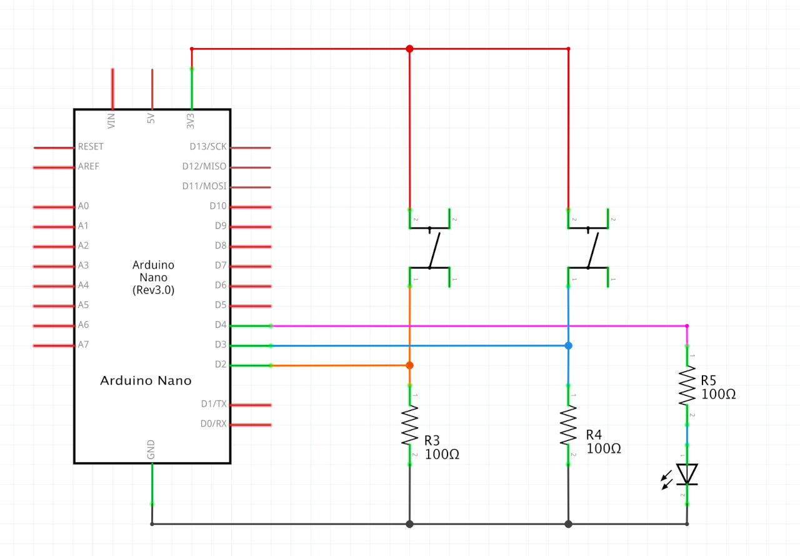
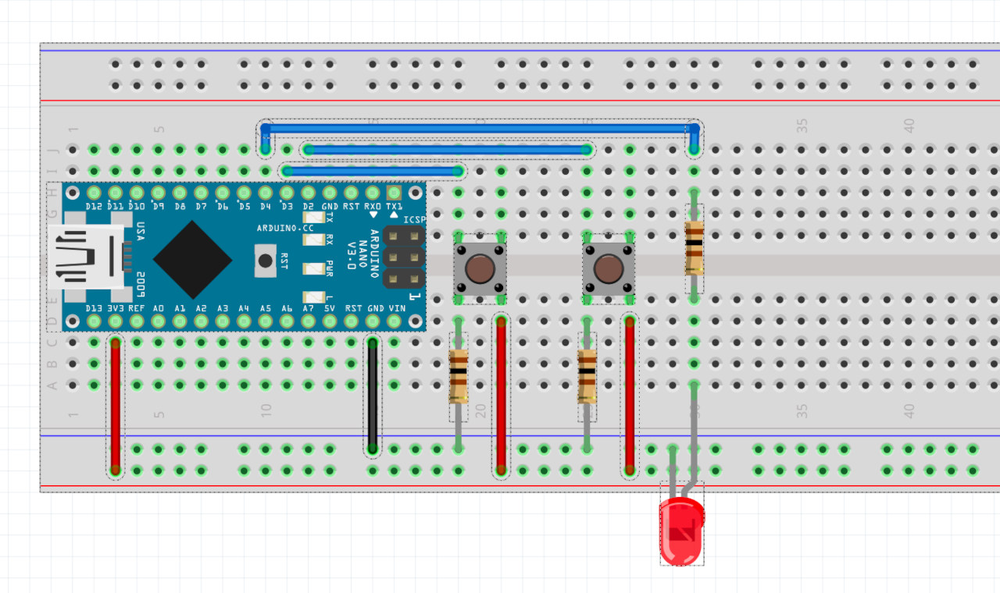
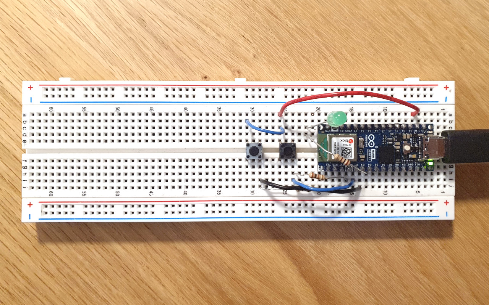
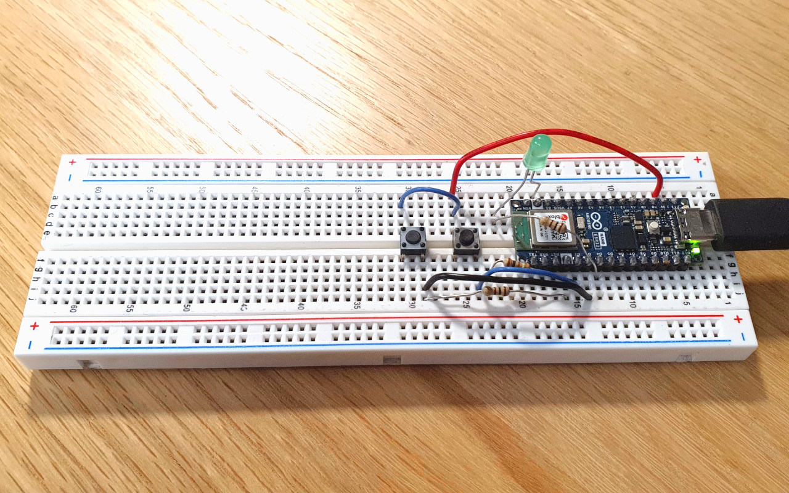

# HW12 - Serial

Maze game from week09 ([code](https://github.com/DM-GY-6063-2023F-D/week09/tree/main/play-maze), [original game](https://dm-gy-6063-2023f-d.github.io/week09/play-maze/)), but updated to use an Arduino with 2 push-buttons to control it.

## p5js -> Arduino

The p5js sketch can send two kinds of commands to the Arduino. These are just one-byte, one-character messages:

```D```: to request new sensor data.

```S```: to indicate the successful completion of a level, so the Arduino can blink the LED.

## Arduino -> p5js

The object that is created by the Arduino and sent to p5js looks like this:

```
data: {
  D2: {
    isPressed: boolean,
  },
  D3: {
    isPressed: boolean,
  }
}
```

```D2.isPressed``` is used to rotate left by 1° and ```D3.isPressed``` to rotate right by 1°.

## Schematic



## Board



## Actual Board




## Video

https://github.com/DM-GY-6063-2023F-D/HW12-Serial/assets/850815/5c1b2864-9721-4a63-a5e0-f8c26f232425

